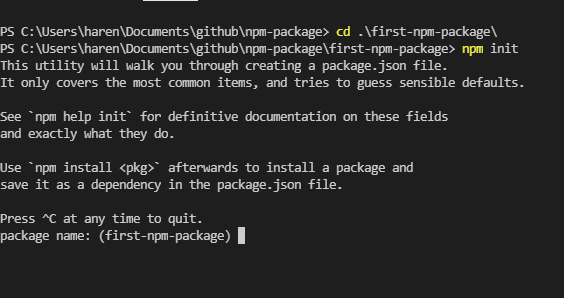
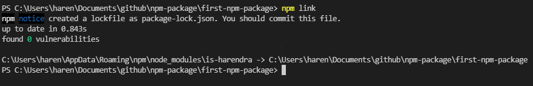
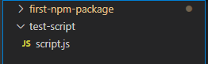
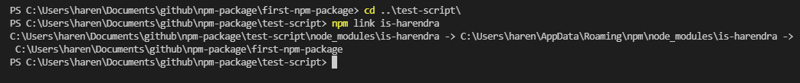
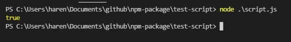
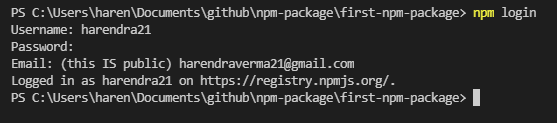
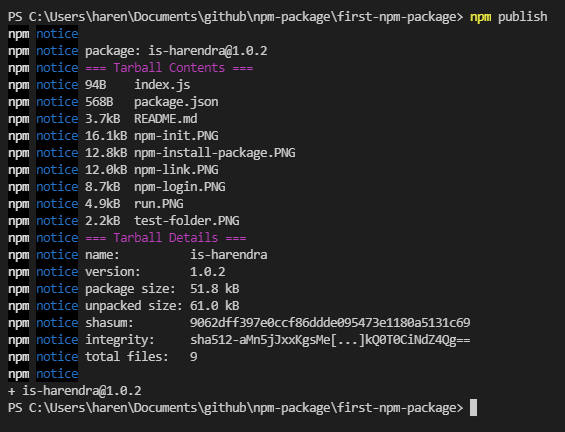
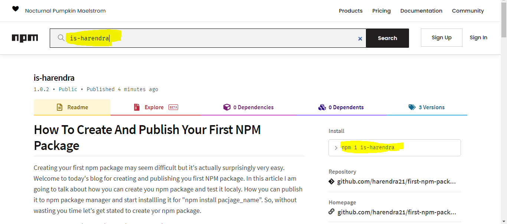

# How To Create And Publish Your First NPM Package?
Creating your first npm package may seem difficult but it's surprisingly very easy. 
Welcome to today's blog for creating and publishing your first NPM package. In this article, I am going to talk about how you can create your npm package and test it locally. How you can publish it to npm package manager and start installing it for "npm install pacjage_name". So, without wasting your time let's get started to create your npm package.

Table of contents

- [How To Create And Publish Your First NPM Package?](#how-to-create-and-publish-your-first-npm-package)
    - [Step 1: Create git repository with a readme file](#step-1-create-git-repository-with-a-readme-file)
    - [Step 2: Init npm to create package JSON](#step-2-init-npm-to-create-package-json)
    - [Step 3: Create the package script file](#step-3-create-the-package-script-file)
    - [Step 4 : Testing](#step-4--testing)
    - [Step 5: Publishing package](#step-5-publishing-package)
    - [Step 6 : Check](#step-6--check)
    - [Summary](#summary)

### Step 1: Create git repository with a readme file
In the very first step, you need to create a git repository with a readme file and clone it locally to start coding in it.

[Learn how to create git repository](https://docs.github.com/en/get-started/quickstart/create-a-repo)


### Step 2: Init npm to create package JSON
So, to create package.json we need to initialize the NPM in our repository. Open a terminal inside the folder and run `npm init`, this will ask for some questions. The package.json file has all the information that our package does, so fill in as much information that you can fill.



This is how our package.json looks like. In this example, we are going to create a package with mane `is-harendra`, which will return true or false based on the input string.

```json
{
  "name": "is-harendra",
  "version": "1.0.0",
  "description": "My first NPM package",
  "main": "index.js",
  "scripts": {
    "test": "echo \"Error: no test specified\" && exit 1"
  },
  "repository": {
    "type": "git",
    "url": "git+https://github.com/harendra21/first-npm-package.git"
  },
  "keywords": [
    "first",
    "npm",
    "package"
  ],
  "author": "Harendra Verma",
  "license": "ISC",
  "bugs": {
    "url": "https://github.com/harendra21/first-npm-package/issues"
  },
  "homepage": "https://github.com/harendra21/first-npm-package#readme"
}
```

### Step 3: Create the package script file
We have specified our main file as `index.js` in our package.json, so we have had to create an `index.js` file inside out application, and inside this file specify the function to perform the action as given below.

```javascript
function isHarendra(string){
    return string == "harendra"
}
module.exports = isHarendra
```

### Step 4 : Testing
So, now we are ready to publish our package. But before publishing the package is necessary to test the application locally. So to test the npm package, need to link the package by running `npm link` inside the package.



Now, create a `test-script` folder outside our application and create a file `script.js` inside that folder, and copy and paste the following code.



```javascript
const isHarendra = require('is-harendra')

console.log(isHarendra('Harendra'))

```

Now open the terminal inside the `test-scripe` and install the package by running `npm link package-name`.



Now if we run this `script.js` in our terminal, we will receive true or false according to the defined string on our terminal.



### Step 5: Publishing package
So now we have successfully tested our code we've written our code it's finally time to publish. To publish our package on NPM we need an NPM account to log in with, if you don't have an account you can [Sign Up](https://www.npmjs.com/signup). Now to log in with the account we have to open the terminal in the package folder and run `npm login`.



Now run `npm publish` to publish our package.



### Step 6 : Check
Now visit the npm website and in the search box enter package name, you will find your package listed there.

[Click here to view is-harendra on npm](https://www.npmjs.com/package/is-harendra)



Anyone can install your package now by running `npm i is-harendra`.

### Summary
In this article, we have learned about "How to create and publish an NPM package?" in an easy very way. I have created and published the npm package in 6 easy steps. I hope by following these steps anyone can easily create an npm package.

Thank you for reading this post, you may like it. Please follow me for more like this.

Other posts :

[Learn JSON in 5 minutes](https://medium.com/p/learn-json-in-5-minutes-e43c19e90b1c)

[Top udemy course to learn to react js for beginners](https://medium.com/p/top-udemy-course-to-learn-react-js-for-beginners-14847941e431)